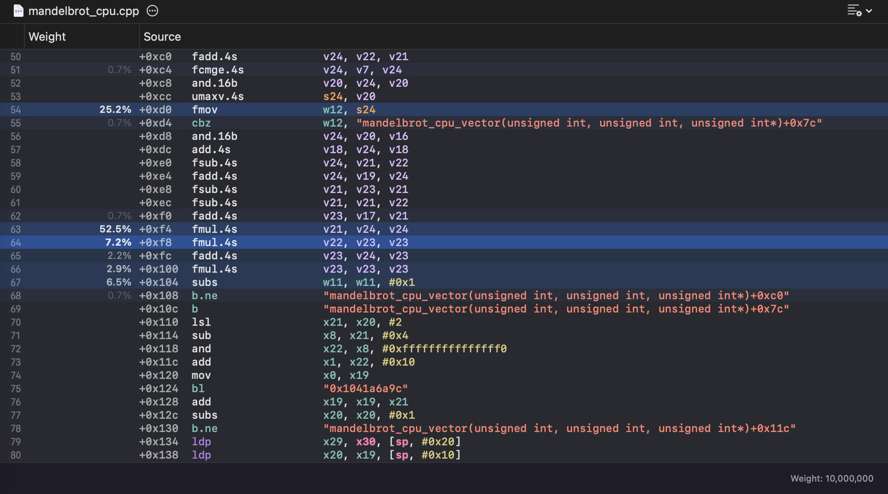
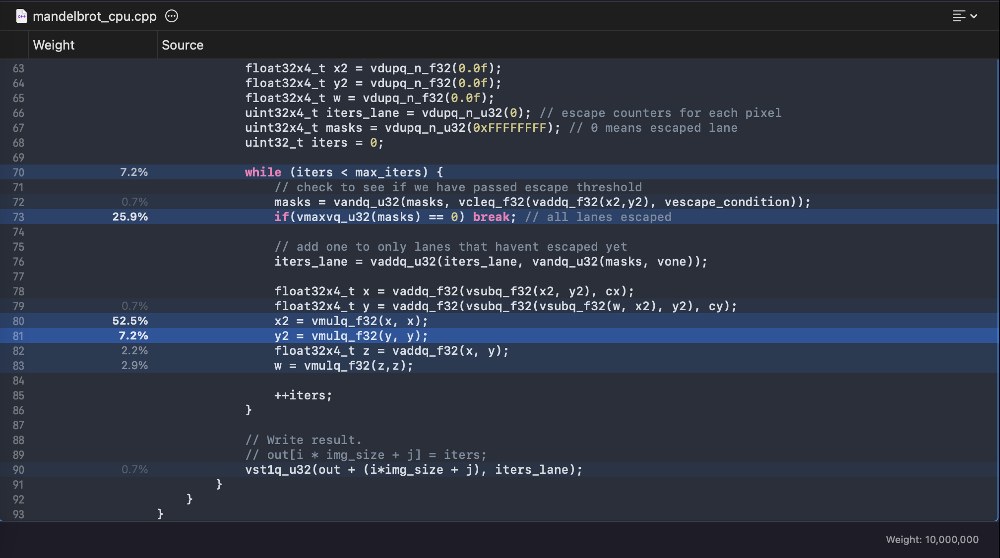

# The Mandelbrot Problem

### The problem

The Mandelbrot set is a set of complex numbers $c= c_x + c_y i$ that fulfill the following expression while remaining bounded:
$$z_{n+1} = z_n^2 + c, z_0=0$$
If at any step the overall value of $|z_n| > 2$ the sequence will diverge. This means that the sequence will also diverge when $|z_n|^2 > 4$. We will define the escape time as the value of $n$ where the sequence diverges.

We aim to try to find the escape time for every pixel in a 2D grid.

### The original solution

The following solution to the problem is given by 6.S894 staff:

```Cpp
// CPU Scalar Mandelbrot set generation.
// Based on the "optimized escape time algorithm" in
// https://en.wikipedia.org/wiki/Plotting_algorithms_for_the_Mandelbrot_set
void mandelbrot_cpu_scalar(uint32_t img_size, uint32_t max_iters, uint32_t *out){
	for (uint64_t i = 0; i < img_size; ++i) {
		for (uint64_t j = 0; j < img_size; ++j) {
		// Get the plane coordinate X for the image pixel.
		float cx = (float(j) / float(img_size)) * 2.5f - 2.0f;
		float cy = (float(i) / float(img_size)) * 2.5f - 1.25f;
		
		// Innermost loop: start the recursion from z = 0.
		float x2 = 0.0f;
		float y2 = 0.0f;
		float w = 0.0f;
		uint32_t iters = 0;
		while (x2 + y2 <= 4.0f && iters < max_iters) {
			float x = x2 - y2 + cx;
			float y = w - x2 - y2 + cy;
			x2 = x * x;
			y2 = y * y;
			float z = x + y;
			w = z * z;
			++iters;
		}
		
		// Write result.
		out[i * img_size + j] = iters;
		}
	}
}
```

1.
The algorithm works by first mapping the screen coordinates $(i,j)$ into the coordinate plane by scaling the indices with the size of the image and adding an offset so the values remain bounded by: $c_x \in [-2.0 , 0.5], c_y \in [-1.25, 1.25]$

2.
 We can find the escape time by using the following mathematical property:
$$ x_{n+1} = x^2_n - y^2_n + c_x$$
$$y_{n+1} = 2x_ny_n + c_y$$
which we can prove correct by:
$$ z_{n+1} = z_n^2 + c = (x_n+iy_n)^2 + c_x + i c_y$$
$$= x_n^2-y_n^2+2ix_ny_n + c_x + ic_y = (x_n^2-y_n^2+c_x) + i(2x_ny_n + c_y)$$
And then finding the value of $z = x^2 + y^2 > 4.0$ (or terminate at max iters)

3.
The algorithm uses the optimization where $w = z^2 = (x+y)^2 = x^2+y^2+2xy$ to quickly get the value of $2xy$ for the next update of $y$ to avoid a multiplication instruction (instead by replacing 2 subtractions)

4.
The algorithm terminates when  $z = x^2 + y^2 > 4.0$ or when max_iters is reached.


The staff solution achieves a runtime of around 47.2 ms when compiled with the -O3 flag.


### My solution

#### The w-problem
The staff solution provides a sufficient algorithm; however, the optimization where we utilize w to save 1 multiplication instruction in favor of 2 additional add/sub instructions ends up hurting performance. While this did save performance in older hardware where the multiplication operation was super expensive, modern hardware makes it much faster (almost as fast as add/sub). In the version where we directly use w=2xy ends up with the following result:

```shell
Testing with image size 256x256 and 1000 max iterations.
Running mandelbrot_cpu_scalar ...
  Runtime: 47.3203 ms
Running mandelbrot_cpu_vector ...
  Runtime: 33.6953 ms
  Correctness: average output difference from reference = 0.000204773
```

This gives us a 1.4x speedup compared to the baseline; however, due to the non-associativity of floating-point numbers, we get a slightly different result compared to the baseline.

If we want to get a fully accurate result to the original staff code, we must live with the reality that we must use this old "optimization".

#### Simple SIMD

For the remainder of this report, we will utilize an M4 MacBook Pro with NEON vectorization.

The first optimization we can try is replacing the standard scalar operations with a more favorable data-level parallelism regime by processing contiguous batches of pixels with vector registers.

We notice that each pixel (c_x, c_y) doesn't rely on results from other pixels, so there are no data dependencies, and therefore we can take advantage of data-level parallelism by processing multiple pixels at a time. We will first set c_y as a scalar and get a lane of c_x values and adapt the exact same algorithm to support vector instructions on the c_x values.

This approach, however, introduces control flow divergence problems. Since some adjacent pixels may reach their escape time before others, we must be able to track active and escaped lanes. We can utilize vector comparison masks so that we only increment the non-escaped lanes.

If the implementation achieves perfect vectorization, we should be able to get a roughly 4x speedup since each vector register supports 4 different 32-bit values (128 bits).


Here is my implementation:
```Cpp
void mandelbrot_cpu_vector(uint32_t img_size, uint32_t max_iters, uint32_t *out) {
	float32x4_t voff = {0, 1, 2, 3};
	float32x4_t vimg_size_lane = vdupq_n_f32(float(img_size));
	float32x4_t vescape_condition = vdupq_n_f32(float(4));
	uint32x4_t vone = vdupq_n_u32(float(1));
	
	for (uint64_t i = 0; i < img_size; ++i) {
		// broadcast across all lanes
		float32x4_t cy = vdupq_n_f32((float(i) / float(img_size)) * 2.5f - 1.25f);
		// 4 elements are calculated at the same time so inc by 4
		for (uint64_t j = 0; j < img_size; j += 4) {
			// Get the plane coordinate X for the 4 image pixel.
			float32x4_t indices_x = vaddq_f32(vdupq_n_f32(float(j)), voff);
			float32x4_t scaled_idx_x = vmulq_f32(vdivq_f32(indices_x, vimg_size_lane), vdupq_n_f32(2.5f));
			
			float32x4_t cx = vsubq_f32(scaled_idx_x, vdupq_n_f32(2.0f));
			
			// Innermost loop: start the recursion from z = 0.
			float32x4_t x2 = vdupq_n_f32(0.0f);
			float32x4_t y2 = vdupq_n_f32(0.0f);
			float32x4_t w = vdupq_n_f32(0.0f);
			uint32x4_t iters_lane = vdupq_n_u32(0); // escape counters for each pixel
			uint32x4_t masks = vdupq_n_u32(0xFFFFFFFF); // 0 means escaped lane
			uint32_t iters = 0;
			
			while (iters < max_iters) {
				// check to see if we have passed escape threshold
				masks = vandq_u32(masks, vcleq_f32(vaddq_f32(x2,y2), vescape_condition));
				if(vmaxvq_u32(masks) == 0) break; // all lanes escaped
				
				
				// add one to only lanes that havent escaped yet
				iters_lane = vaddq_u32(iters_lane, vandq_u32(masks, vone));
				
				float32x4_t x = vaddq_f32(vsubq_f32(x2, y2), cx);
				float32x4_t y = vaddq_f32(vsubq_f32(vsubq_f32(w, x2), y2), cy);
				x2 = vmulq_f32(x, x);
				y2 = vmulq_f32(y, y);
				float32x4_t z = vaddq_f32(x, y);
				w = vmulq_f32(z,z);
				
				++iters;
			}
			// Write result.
			vst1q_u32(out + (i*img_size + j), iters_lane);
		}
	}
}
```


This solution takes advantage of NEON within Mac to achieve the following results:
```shell
Testing with image size 256x256 and 1000 max iterations.
Running mandelbrot_cpu_scalar ...
  Runtime: 45.7729 ms
Running mandelbrot_cpu_vector ...
  Runtime: 12.1077 ms
  Correctness: average output difference from reference = 0
```

A speed up of 3.7x!

While this does fall below our 4x threshold, due to extra instructions relating to mask computation and the control flow divergence, we still get a noticeable speedup compared to the baseline!


###  Eliminating the data dependency

Although vectorization has given us a substantial speedup due to data-level parallelism, we are still bottlenecked by the data dependency of calculations. After benchmarking the new implementation with 100 samples and recording the trace, we can utilize Apple Instruments to see that there is a very critical section that halts execution:




We notice that over 50% of the time is spent on the `vmulq` operation relating to the `x2` value. It might be tempting to say that it's because vector multiplication is slow, we notice that other vector multiplications are much faster than the `x2` calculation. The real culprit is the data dependency on `x`, which is calculated right before `x2`, causing a pipeline stall until the value of `x` is resolved.

We can eliminate this data hazard and improve performance further via loop unrolling. By utilizing loop unrolling, we can kill two birds with one stone by eliminating this data hazard and reducing the number of branching operations for the loops. We will aim to unroll the loop by a factor of 4, meaning we calculate 16 pixels at a time.

Here is my implementation

``` Cpp
void mandelbrot_cpu_vector(uint32_t img_size, uint32_t max_iters, uint32_t *out) {
	float32x4_t voff = {0, 1, 2, 3};
	float32x4_t vimg_size_lane = vdupq_n_f32(float(img_size));
	float32x4_t vescape_condition = vdupq_n_f32(float(4));
	uint32x4_t vone = vdupq_n_u32(float(1));
	for (uint64_t i = 0; i < img_size; i += 4) {
		// 4 y values broadcasted
		float32x4_t cy_0 = vdupq_n_f32((float(i) / float(img_size)) * 2.5f - 1.25f);
		float32x4_t cy_1 = vdupq_n_f32((float(i+1) / float(img_size)) * 2.5f - 1.25f);
		float32x4_t cy_2 = vdupq_n_f32((float(i+2) / float(img_size)) * 2.5f - 1.25f);
		float32x4_t cy_3 = vdupq_n_f32((float(i+3) / float(img_size)) * 2.5f - 1.25f);
		
		// 4 elements are calculated at the same time so inc by 4
		for (uint64_t j = 0; j < img_size; j += 4) {
			// Get the plane coordinate X for the 4 image pixel.
			float32x4_t indices_x = vaddq_f32(vdupq_n_f32(float(j)), voff);
			float32x4_t scaled_idx_x = vmulq_f32(vdivq_f32(indices_x, vimg_size_lane), vdupq_n_f32(2.5f));
			float32x4_t cx = vsubq_f32(scaled_idx_x, vdupq_n_f32(2.0f));
			
			  
			
			// Each x, y, w, iterlane are meant for one specific y-coordiante
			
			float32x4_t x2_0 = vdupq_n_f32(0.0f);
			float32x4_t x2_1 = vdupq_n_f32(0.0f);
			float32x4_t x2_2 = vdupq_n_f32(0.0f);
			float32x4_t x2_3 = vdupq_n_f32(0.0f);
			  
			float32x4_t y2_0 = vdupq_n_f32(0.0f);
			float32x4_t y2_1 = vdupq_n_f32(0.0f);
			float32x4_t y2_2 = vdupq_n_f32(0.0f);
			float32x4_t y2_3 = vdupq_n_f32(0.0f);
			
			float32x4_t w_0 = vdupq_n_f32(0.0f);
			float32x4_t w_1 = vdupq_n_f32(0.0f);
			float32x4_t w_2 = vdupq_n_f32(0.0f);
			float32x4_t w_3 = vdupq_n_f32(0.0f);
			
			uint32x4_t iters_lane_0 = vdupq_n_u32(0); // escape counters for each pixel
			uint32x4_t iters_lane_1 = vdupq_n_u32(0);
			uint32x4_t iters_lane_2 = vdupq_n_u32(0);
			uint32x4_t iters_lane_3 = vdupq_n_u32(0);
			
			uint32x4_t masks_0 = vdupq_n_u32(0xFFFFFFFF); // 0 means escaped lane
			uint32x4_t masks_1 = vdupq_n_u32(0xFFFFFFFF);
			uint32x4_t masks_2 = vdupq_n_u32(0xFFFFFFFF);
			uint32x4_t masks_3 = vdupq_n_u32(0xFFFFFFFF);
			
			uint32_t iters = 0;
			
			while (iters < max_iters) {
				// check to see if we have passed escape threshold
				masks_0 = vandq_u32(masks_0, vcleq_f32(vaddq_f32(x2_0,y2_0), vescape_condition));
				masks_1 = vandq_u32(masks_1, vcleq_f32(vaddq_f32(x2_1,y2_1), vescape_condition));
				masks_2 = vandq_u32(masks_2, vcleq_f32(vaddq_f32(x2_2,y2_2), vescape_condition));
				masks_3 = vandq_u32(masks_3, vcleq_f32(vaddq_f32(x2_3,y2_3), vescape_condition));
				  
				if(vmaxvq_u32(vorrq_u32(vorrq_u32(masks_0, masks_1), vorrq_u32(masks_2, masks_3))) == 0) break; // all lanes escaped
				  
				// add one to only lanes that havent escaped yet
				iters_lane_0 = vaddq_u32(iters_lane_0, vandq_u32(masks_0, vone));
				iters_lane_1 = vaddq_u32(iters_lane_1, vandq_u32(masks_1, vone));
				iters_lane_2 = vaddq_u32(iters_lane_2, vandq_u32(masks_2, vone));
				iters_lane_3 = vaddq_u32(iters_lane_3, vandq_u32(masks_3, vone));
				
				float32x4_t x_0 = vaddq_f32(vsubq_f32(x2_0, y2_0), cx);
				float32x4_t x_1 = vaddq_f32(vsubq_f32(x2_1, y2_1), cx);
				float32x4_t x_2 = vaddq_f32(vsubq_f32(x2_2, y2_2), cx);
				float32x4_t x_3 = vaddq_f32(vsubq_f32(x2_3, y2_3), cx);
				
				float32x4_t y_0 = vaddq_f32(vsubq_f32(vsubq_f32(w_0, x2_0), y2_0), cy_0);
				float32x4_t y_1 = vaddq_f32(vsubq_f32(vsubq_f32(w_1, x2_1), y2_1), cy_1);
				float32x4_t y_2 = vaddq_f32(vsubq_f32(vsubq_f32(w_2, x2_2), y2_2), cy_2);
				float32x4_t y_3 = vaddq_f32(vsubq_f32(vsubq_f32(w_3, x2_3), y2_3), cy_3);
				
				x2_0 = vmulq_f32(x_0, x_0);
				x2_1 = vmulq_f32(x_1, x_1);
				x2_2 = vmulq_f32(x_2, x_2);
				x2_3 = vmulq_f32(x_3, x_3);
				
				y2_0 = vmulq_f32(y_0, y_0);
				y2_1 = vmulq_f32(y_1, y_1);
				y2_2 = vmulq_f32(y_2, y_2);
				y2_3 = vmulq_f32(y_3, y_3);
				
				float32x4_t z_0 = vaddq_f32(x_0, y_0);
				float32x4_t z_1 = vaddq_f32(x_1, y_1);
				float32x4_t z_2 = vaddq_f32(x_2, y_2);
				float32x4_t z_3 = vaddq_f32(x_3, y_3);
				
				w_0 = vmulq_f32(z_0, z_0);
				w_1 = vmulq_f32(z_1, z_1);
				w_2 = vmulq_f32(z_2, z_2);
				w_3 = vmulq_f32(z_3, z_3);
				++iters;
			} 
			// Write result.
			vst1q_u32(out + (i*img_size + j), iters_lane_0);
			vst1q_u32(out + ((i+1)*img_size + j), iters_lane_1);
			vst1q_u32(out + ((i+2)*img_size + j), iters_lane_2);
			vst1q_u32(out + ((i+3)*img_size + j), iters_lane_3);
		}
	}
}
```

This solution achieves the following results:
```shell
Testing with image size 256x256 and 1000 max iterations.
Running mandelbrot_cpu_scalar ...
  Runtime: 45.7859 ms
Running mandelbrot_cpu_vector ...
  Runtime: 4.32117 ms
  Correctness: average output difference from reference = 0
```

This is a speedup of almost 2.7x compared to the previous iteration and a whopping 10.6x compared to the staff baseline!

We can also see the difference in larger images here:
``` shell
Testing with image size 1024x1024 and 2000 max iterations.
Running mandelbrot_cpu_scalar ...
  Runtime: 1448.17 ms
Running mandelbrot_cpu_vector ...
  Runtime: 134.282 ms
  Correctness: average output difference from reference = 0
```

A speed up of 10.7x
### Parallelization & Multithreading

Since the escape time for each pixel does not depend on other pixels, we can parallelize the program without worrying about concurrency issues like double writes. 

We can trivially add `#pragma omp parallel for schedule(dynamic, 4)` on the first for loop in the previous program to schedule each thread to do 4 iterations of the for loop

For a large image we get the following result:
```shell
Testing with image size 1024x1024 and 2000 max iterations.
Running mandelbrot_cpu_scalar ...
  Runtime: 1448.69 ms
Running mandelbrot_cpu_vector ...
  Runtime: 21.2352 ms
  Correctness: average output difference from reference = 0
```
A speed up of 68x! 

For a medium sized image the result is:
```shell
Testing with image size 256x256 and 1000 max iterations.
Running mandelbrot_cpu_scalar ...
  Runtime: 45.764 ms
Running mandelbrot_cpu_vector ...
  Runtime: 0.984083 ms
  Correctness: average output difference from reference = 0
```

A speedup of 46x!

For a small image the result is:
``` shell
Testing with image size 32x32 and 1000 max iterations.
Running mandelbrot_cpu_scalar ...
  Runtime: 1.37888 ms
Running mandelbrot_cpu_vector ...
  Runtime: 0.066959 ms
  Correctness: average output difference from reference = 0
```

A speedup of 20.6x!

We notice quite a large speedup however, unlike before larger images have a higher speedup factor. This is primarily due to the overhead of setting up multithreading, meaning that for larger images the overhead represents a smaller portion of the time compared to the smaller images.


### Potential Future Optimizations

As it currently stands, a large portion of the pixels iterate until we reach the cap, meaning that we could try to identify the pixels that would reach the maximum and exit early. I estimate a speedup of around 1.3x could be achievable compared to the baseline since roughly 30% of the pixels reach the max_iters escape time.

Reworking the unrolling format from 4x4 blocks to 1x16 chunks also proves to be more useful since each cache line is 64 bytes (i.e., 16 pixels), meaning we have a more cache-friendly structure.

Finally, there are a number of mathematical optimizations we could do, but a lot of them tend to have floating-point drift due to the reordering of non-associative floating-point operations.


